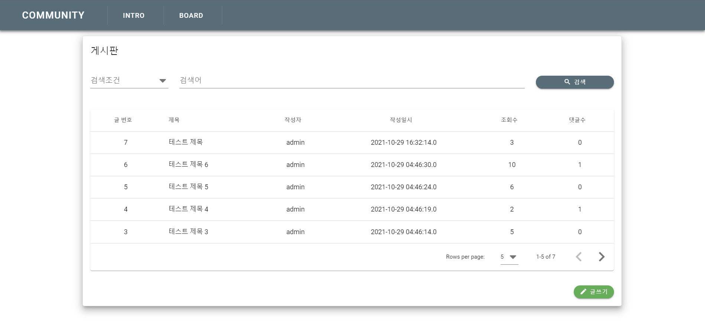

### Architecture

---

### 구현 화면

[ Intro ]

[ Board list ]

[ Board detail ]

[ Board edit ]

[ Board write ]

---

### Demo URL
[Demo page](http://ec2-13-209-77-8.ap-northeast-2.compute.amazonaws.com)

---

### 메뉴 목록

- Home
- Board

---

### 기능 목록

- 게시판 목록 조회, 글 상세 정보 조회
- 게시글 작성, 수정, 삭제
- 댓글 작성, 수정, 삭제
- 조회수 표시, 댓글 수 표시
- 항목별 검색 기능
- 항목별 정렬 기능
- 페이징 처리
- 페이지 이동시 데이터 유지
- 에러 처리

---

### 개발 환경 설정

- Vue 개발 환경 설정
- Spring Boot 개발 환경 설정
- MariaDB 개발 환경 설정
- Vue - Spring Boot - MariaDB 연동 확인

---

### DB table 설계

- 게시글 테이블 설계
- 댓글 테이블 설계
- 테이블 생성

---

### Spring Boot API 개발

- dependency 설정 및 properties 설정
- DTO class 구현
- Controller 구현
- Repository 구현
- Service 구현
- MyBatis sql mapper 구현
- API Test

---

### Vue client app 개발

- 공통 컴포넌트 구성
    - Header
    - Editor
    - Button
    - Snackbar (Alert)
    - Pageviewer
- 게시판 컴포넌트 구성
    - List
    - Write
    - Detail
    - Edit
- Views 구성
    - 에러 view
        - 404 error
    - 게시판 view
        - ListView
        - WriteView
        - DetailView
        - EditView
- axios api 구성
- plugin 구성
    - vuetify
    - dialog
    - page move function
- router 구성
- store 구성
- App.vue 구성
---

### 애플리케이션 테스트